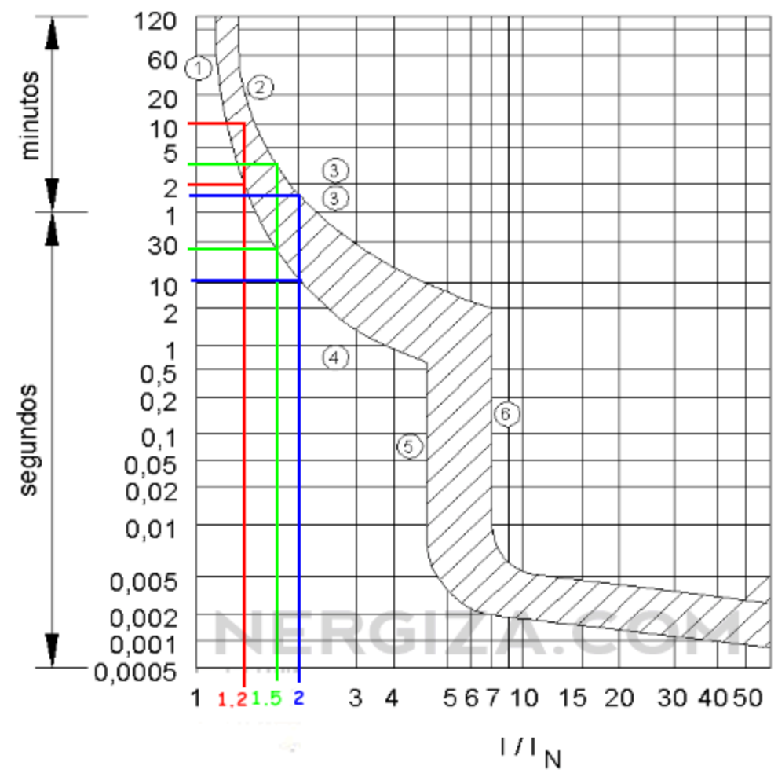
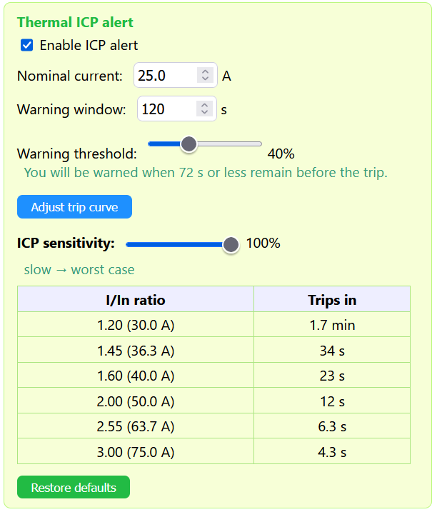

# ⚡ MULTIMETREITOR

Home electrical consumption monitor based on the **ESP8266** and the **PZEM-004T v3.0** energy meter. It measures the voltage, current, power, energy, frequency and power factor of your mains installation, shows them on an LCD display and publishes them over **MQTT**. It also includes a **thermal model of the ICP** (the main circuit breaker / power-control switch used in Spain) that warns you *before* the utility cuts your power for drawing too much.

It ships with a **web configuration panel** served by the device itself and a **Rainmeter skin** to display the metrics on the Windows desktop.

---

## ✨ Features

- 📊 **Real-time measurement** via the PZEM-004T v3: voltage (V), current (A), power (W), energy (kWh), frequency (Hz) and power factor.
- 🔥 **ICP thermal model**: a first-order thermal-image model (IEC 60255-149) of the main breaker's bimetal that tracks how much of its trip time is already used up, driven by a single **worst-case-by-default sensitivity selector**. Warns you *before* the utility cuts your power for drawing too much. See [ICP thermal model](#-icp-thermal-model).
- 🚨 **Configurable alerts**: ICP, overvoltage, undervoltage and consumption (by amperes or watts), with an optional **buzzer**.
- 🖥️ **16×2 I2C LCD** with metrics selectable through a bitmask plus WiFi/MQTT status indicators.
- 🌐 **Responsive web panel** (HTML embedded in `PROGMEM`) to configure everything without recompiling.
- 🌍 **Bilingual UI (Spanish / English)** in both the web panel and the Rainmeter skin, with a one-click toggle. Default is Spanish.
- 📡 **MQTT publishing** with a unified JSON payload and *retained* messages.
- 🗓️ **Monthly consumption history** (24 months) with automatic energy reset on month change, persisted to EEPROM.
- 🕐 **NTP synchronization** with the Spanish mainland timezone (CET/CEST with automatic DST changes).
- 🔄 **OTA updates** (Over-The-Air), password protected.
- 💾 **EEPROM persistence** with integrity validation (magic + version) and wear protection (1-hour write cooldown for automatic tasks).

<div align="center">
  
  <br>
  <em>Web configuration panel — mobile view (English)</em>
</div>

---

## 🔌 Hardware

| Component             | Detail                                    |
|-----------------------|-------------------------------------------|
| MCU                   | ESP8266 (NodeMCU / Wemos D1 mini)         |
| Meter                 | PZEM-004T v3.0 (UART)                      |
| Display               | 16×2 LCD with I2C backpack (address `0x27`) |
| Alarm                 | Active buzzer                             |

### Wiring (pins)

| Signal            | ESP8266 pin | Notes                          |
|-------------------|-------------|--------------------------------|
| PZEM RX           | `D6`        | `SoftwareSerial` RX            |
| PZEM TX           | `D5`        | `SoftwareSerial` TX            |
| LCD SDA / SCL     | `D2` / `D1` | Default I2C (`Wire`)           |
| Buzzer            | `D7`        | Digital output                 |


---

## 🧩 Firmware architecture


**Monolithic** firmware (`multimetreitor.ino`) organized into functional blocks:

- **Config / EEPROM** — `struct AppConfig` serialized to EEPROM with validation and default values.
- **WiFi / OTA / NTP** — connection with retries, OTA and time sync via a POSIX TZ string.
- **MQTT** — publishes state, log and status; recovers the ICP state at boot (reads the *retained* message from its own topic).
- **ICP model** (`computeICP`) — integrates the breaker's thermal state from the I/Iₙ ratio with a first-order thermal-image model (IEC 60255-149). See [ICP thermal model](#-icp-thermal-model).
- **Alerts** (`evaluateAlerts`) — priority: ICP → overvoltage → undervoltage → consumption.
- **LCD** (`composeLCDLines`) — composes two 16-character lines with the active metrics.
- **Web server** — configuration panel + JSON endpoints.
- **History** — monthly consumption management and month-change handling.

### MQTT topics

| Topic                              | Direction  | Content                                          |
|------------------------------------|------------|--------------------------------------------------|
| `electricidad/casa/estado`         | publish    | JSON with all metrics and active alerts (*retained*) |
| `electricidad/casa/icp`            | subscribe  | ICP state recovery at boot                       |
| `electricidad/casa/alertas_config` | publish    | Alert configuration: enabled flags + thresholds (*retained*, refreshed on connect and on config save) |
| `multimetreitor/status`            | publish    | `online` (*retained*)                            |
| `multimetreitor/serial`            | publish    | Serial-port log                                  |

**Example state payload:**

```json
{
  "voltaje": "230.5V",
  "corriente": "12.34A",
  "potencia": "2840W",
  "energia": "123.45kWh",
  "factor_potencia": "0.95",
  "frecuencia": "50.0Hz",
  "icp": "62%",
  "alerts": ["sobretension"],
  "timestamp": 1700000000
}
```

> ℹ️ The JSON keys are in Spanish (`voltaje`, `corriente`, …) because they are the published data contract consumed by the Rainmeter skin.

`alerts` lists the currently active alerts (`[]` when none): `icp`, `sobretension`, `subtension`, `consumo`. The same array is served by the web endpoint `/json`. To interpret it, external apps can read the alert configuration (enabled checkbox + configured threshold per alert) from the retained `electricidad/casa/alertas_config` topic or from `/json_alerts`:

```json
{
  "sobretension": { "enabled": true,  "umbral": 250.0, "unidad": "V" },
  "subtension":   { "enabled": true,  "umbral": 200.0, "unidad": "V" },
  "consumo":      { "enabled": false, "umbral": 0.00,  "unidad": "W" },
  "icp":          { "enabled": true,  "nominal": 25.00, "umbral": 40, "unidad": "%" }
}
```

---

## 🔥 ICP thermal model

In Spain the **ICP** (*Interruptor de Control de Potencia*) is the main breaker the utility uses to enforce your contracted power: draw more current than your tariff allows for long enough and it trips, leaving the house dark. It is a **thermal-magnetic** device — a bimetal strip that bends as it heats (slow, inverse-time overloads) plus a magnetic coil for instantaneous short-circuit trips. MULTIMETREITOR models the **thermal** half so it can warn you *seconds before* the bimetal lets go, while you can still go and switch something off.

### The reference curve

A thermal-magnetic breaker does not trip at a fixed time; the maker only guarantees a **band** (manufacturing tolerance + ambient temperature). The model is fitted to the slow/fast edges of this **UNE 20317** magneto-thermal band:

<div align="center">
  
  <br>
  <em>UNE 20317 trip band. The hatched area is the tolerance band; the coloured verticals at 1.2×, 1.5× and 2×Iₙ mark where the fast (lower) and slow (upper) edges cross — e.g. at 2×Iₙ the breaker may trip anywhere from ~10 s to ~2 min. The steep fall at 5–8×Iₙ is the magnetic (instantaneous) region, not modelled here.</em>
</div>

The band is enormous — roughly a **factor of ~80 in time** at a given current — so no single curve is "the" correct one. Rather than pick a middle guess, MULTIMETREITOR lets you slide across the band and **defaults to the worst (fastest) edge** (see the sensitivity selector below).

### The algorithm

Instead of a lookup table, the firmware runs the standard **first-order thermal image** of **IEC 60255-149** — the same model real numerical protection relays use. It keeps one state variable, `H`, the normalized heat of the bimetal, where `H = 1.0` (100 %) is the trip itself. Every cycle it relaxes `H` towards the equilibrium heat for the current flowing right now:

```
H  ←  Heq + (H − Heq) · e^(−Δt/τ)          Heq = (I / Iₙ)² / k²
```

- **`I / Iₙ`** — measured current over the configured nominal (contracted) current.
- **`k`** — trip threshold as a multiple of Iₙ. Below `k` the equilibrium `Heq ≤ 1`, so `H` can never reach the trip: **the breaker holds forever**. Default `k = 1.07`.
- **`τ`** — thermal time constant, i.e. how fast the bimetal heats and cools. Default `τ = 384 s`.
- The **square** in `Heq` is Joule's law: heating is proportional to `I²`.

From `H` and the present current, the model solves the same equation forward to get the number the user actually needs — **seconds left before the trip**:

```
t = τ · ln( (Heq − H) / (Heq − 1) )        (defined while Heq > 1, i.e. I > k·Iₙ)
```

These are `computeICP()` (the integrator) and `icpSegundosRestantes()` (the forward solve) in `multimetreitor.ino`.

### Sensitivity selector (worst case by default)

The whole tolerance band is exposed as **one** control — *ICP sensitivity*, 0–100 % — so there are no cryptic parameters to tune. It does **not** touch `k` or `τ` (which would make the reading twitchy); it sets a **preheat floor**, the minimum thermal state the bimetal is assumed to have started this overload from:

```
floor = (sensitivity / 100) · FLOOR_MAX          FLOOR_MAX = 0.922
```

The countdown then assumes `H` is at least `floor` — but the **real integrated heat still wins whenever it is higher**, so an already-hot breaker is never underestimated:

- **100 % — worst case (default).** `floor = 0.922`: assume the breaker is nearly preheated, i.e. the **fast edge** of the band → shortest, most cautious time-to-trip. It is the default because a false alarm is a minor annoyance, but a missed trip is a dark house.
- **0 % — slow.** `floor = 0`: cold start, the **slow edge** of the band → latest possible warning.

At the worst-case default (Iₙ = 25 A) the model reproduces the fast edge of the reference image:

| I / Iₙ | Current | Trips in (worst case) |
|:------:|:-------:|:---------------------:|
| 1.20   | 30.0 A  | ~1.7 min |
| 1.45   | 36.3 A  | ~34 s |
| 2.00   | 50.0 A  | ~12 s |
| 3.00   | 75.0 A  | ~4.3 s |

### Cooling

Cooling is **not** a separate rule: it is the very same equation relaxing towards a *lower* equilibrium. When the current drops, `Heq` falls (it goes with `I²`), so `H` decays **exponentially** towards it — all the way to 0 with no load. It is not the old "N seconds from 100 % to 0 %, linearly".

The de-energized cooling constant is `τ₂`, used when the breaker draws essentially nothing (below 5 % of Iₙ — house off, mains down or already tripped). For a **passive bimetal, cooling is as slow as heating**, so `τ₂ = τ = 384 s` by design; the two are kept as separate fields only because the standard allows them to differ. After a reboot, elapsed offline cooling is applied in closed form, `H = H_stored · e^(−t_off/τ₂)` — and skipped entirely if there is no valid NTP clock (the conservative choice: keep the last known heat rather than assume it cooled).

### The danger bar and the warning

What you see on the LCD, web panel, MQTT and Rainmeter is a **countdown bar**, not the raw heat: it reads *how much of your reaction time is already gone*, as a percentage of a configurable **warning window** (default 120 s):

```
bar = 100 · (1 − t_left / window)        (0 when t_left ≥ window, or when this load can never trip)
```

Shown this way, the percentage means the same thing at every current — with a 120 s window, 50 % is always 60 seconds left — whereas the raw heat would be ten seconds at 64 A and six minutes at 33 A. The alert fires (and the buzzer sounds) when the bar reaches the **warning threshold**, i.e. when

```
t_left ≤ window · (1 − threshold / 100)
```

For example, a 120 s window at a 40 % threshold warns you when **72 s or less** remain before the trip (`120 · (1 − 0.40)`). Alerts must persist for `ALERT_TRIGGER_SAMPLES = 3` consecutive readings to latch, so with the PZEM's ~1.3 s averaging the confirmed warning lands a few seconds after the overload actually begins.

<div align="center">
  
  <br>
  <em>ICP panel in the web config: nominal current, warning window, warning threshold, the sensitivity selector (shown at worst case) and the resulting trip table.</em>
</div>

### Persistence

The thermal state survives a reboot: `computeICP()` publishes `H` (with a timestamp) to a *retained* MQTT topic, and at boot the device reads it back, applies the elapsed cooling and resumes — so a breaker that was hot before a brief power blip is not treated as cold. Real overload episodes (and probable trips) are also written to a small on-device forensic ring buffer and published over MQTT.

> ℹ️ **Calibration.** The factory band is so wide that no theoretical curve is exactly right for one physical breaker. The defaults (`k = 1.07`, `τ = 384 s`, worst-case sensitivity) follow the UNE 20317 image above and deliberately err early; the episode log exists so the model can later be refined against **real trips** rather than nameplate figures.

---

## 🖥️ Rainmeter skin

`Rainmeter/Multimetreitor/` contains a skin that displays the MULTIMETREITOR metrics directly on the Windows desktop, consuming the data over MQTT.

**Skin features:**

- Reads from the MQTT broker through Rainmeter's **[MqttClient](https://github.com/anschnapp/MqttPlugin)** plugin and parses the JSON published by the firmware.
- Shows: **Voltage, Frequency, Current, ICP (progress bar), Power, Power Factor and monthly Consumption**.
- **Visual warnings**: red background on *Current* when it exceeds 30 A, and an ICP bar proportional to the thermal load (width = `ICP × 2.5`).
- Automatically fixes locale decimals (comma → dot) and the connection status for internal calculations (`Substitute`).
- Includes optional support for a **water heater** (`calentador_estado`, `calentador_corriente`) that lights up red when it is off.
- **Bilingual labels (ES/EN)** — click the language button (top-right of the skin) to switch; the choice is saved in the `Language` variable (see [Languages](#-languages-es--en)).

### Installing the skin

1. Install [Rainmeter](https://www.rainmeter.net/).
2. Install the **MqttClient** plugin (copy the `.dll` into `Rainmeter/Plugins`).
3. Copy the `Rainmeter/Multimetreitor` folder into `Documents/Rainmeter/Skins/`.
4. Edit the `[Variables]` section of the `.ini` and set:
   - `MQTT_BROKER` → your MQTT broker IP.
   - `MQTT_TOPIC` → the firmware's state topic (`electricidad/casa/estado`).
5. Load the skin from Rainmeter (*Refresh all* / *Manage*).

> ℹ️ By default the `.ini` ships with `MQTT_TOPIC=rainmeter/multimetreitor`; change it to the topic the firmware actually publishes (`electricidad/casa/estado`) or adapt the topic on the device.

---

## 🌍 Languages (ES / EN)

Both UIs are bilingual and **default to Spanish**. Only the labels/UI text are translated — the metric values and units (V, A, W…) are language-neutral.

### Web panel
- Click the **`EN` / `ES` button** at the top-right of the page to switch language instantly (client-side, no reload).
- The choice is remembered per browser via `localStorage` (`mmt_lang`).
- To add or tweak strings, edit the `I18N = { es: {…}, en: {…} }` dictionary in the embedded `<script>` of `multimetreitor.ino`. Translatable elements are marked with `data-i18n="key"`.

### Rainmeter skin
- Click the **language button** at the top-right of the skin to toggle ES ⇄ EN. The choice is persisted to the `Language` variable in the `.ini` (`!WriteKeyValue` + `!Refresh`).
- This uses Rainmeter's standard localization pattern: a `Language` variable in `[Variables]` plus `@Include=#@#Lang_#Language#.inc`.
- Translations live in `Rainmeter/Multimetreitor/@Resources/Lang_ES.inc` and `Lang_EN.inc`. To change the default, set `Language=ES` (or `EN`) in `[Variables]`.

---

## 🛠️ Build and flash

**Requirements (Arduino IDE / arduino-cli):**

- **ESP8266** Arduino core.
- Libraries: `PubSubClient`, `LiquidCrystal_I2C`, `PZEM004Tv30`, `ArduinoJson`, `ESP8266WebServer`, `ArduinoOTA`, `EspSoftwareSerial`.

**Steps:**

1. **Create your `secrets.h`** (see below) with your WiFi credentials.
2. Open `multimetreitor.ino` in the Arduino IDE.
3. Select the matching ESP8266 board.
4. Adjust the static IP / network configuration in `multimetreitor.ino` if needed.
5. Upload over USB the first time; afterwards you can update over **OTA** (hostname `multimetreitor-ota`).

### 🔐 Credentials (`secrets.h`)

WiFi credentials are kept **out of the source tree** in a `secrets.h` file that is git-ignored, so they are never committed. The repo ships a template, `secrets.h.example`.

To configure after cloning:

```bash
cp secrets.h.example secrets.h
```

Then edit `secrets.h` with your own values:

```cpp
#define WIFI_SSID      "YOUR_WIFI_SSID"
#define WIFI_PASSWORD  "YOUR_WIFI_PASSWORD"
```

`multimetreitor.ino` includes it via `#include "secrets.h"` and uses `WIFI_SSID` / `WIFI_PASSWORD`. The WiFi password is also reused as the OTA password.

> ℹ️ The static IP (`192.168.1.24`), gateway and hostnames are configured directly in `multimetreitor.ino` — adjust them to your network.

---

## 🏠 Network note

MULTIMETREITOR is designed as a **local home-network appliance**: the web panel keeps things fast and simple and is meant to live inside your own trusted Wi‑Fi. As such, **run it on a secure/trusted network and don't expose it directly to the Internet** (no port-forwarding) — that's the intended setup. For multi-user or untrusted environments you can add HTTP Basic Auth to the control endpoints.

---

## 📝 License

Licensed under the **GNU General Public License v3.0** — see [LICENSE](LICENSE).

Copyright © tonikelope
