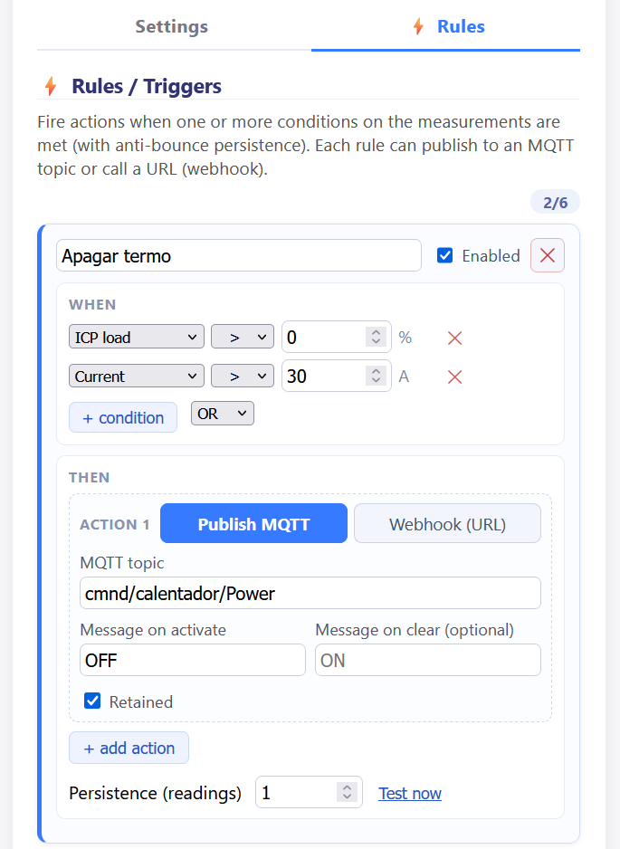
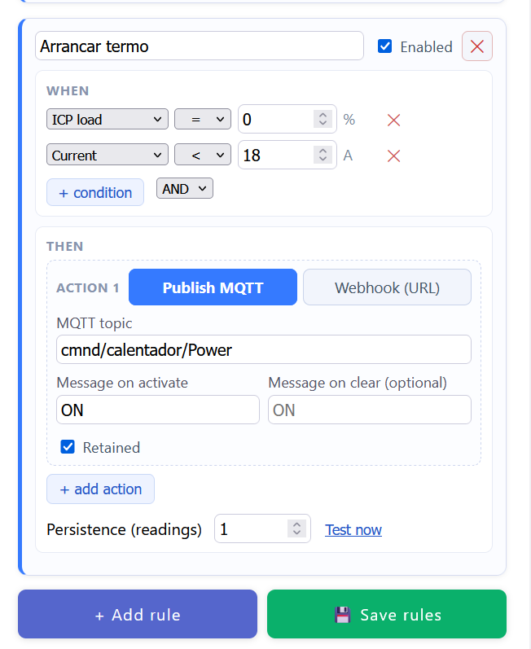
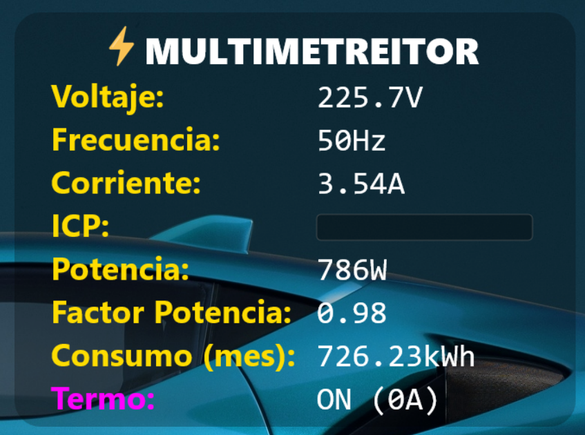

# ⚡ MULTIMETREITOR

<div align="justify">

Home electrical consumption monitor based on the **ESP8266** and the **PZEM-004T v3.0** energy meter. It measures the voltage, current, power, energy, frequency and power factor of your mains installation, shows them on an LCD display and publishes them over **MQTT**. It also includes a **thermal model of the ICP** (the main circuit breaker used in Spain to enforce your contracted power) that warns you *before* the utility cuts your power for drawing too much.

Beyond monitoring, a built-in **rules engine** can fire actions (an MQTT publish or a webhook) when your own conditions on the measurements are met, so the device can act on its own, for example by shedding a load such as a water heater before the ICP trips.

It ships with a **web configuration panel** served by the device itself and a **Rainmeter skin** to display the metrics on the Windows desktop.

</div>

---

## ✨ Features

<div align="justify">

- 📊 **Real-time measurement** via the PZEM-004T v3: voltage (V), current (A), power (W), energy (kWh), frequency (Hz) and power factor.
- 🔥 **ICP thermal model**: a first-order thermal-image model (IEC 60255-149) of the main breaker's bimetal, integrated continuously from the measured current, shown as a bar that reads empty in ordinary use and fills as the breaker approaches its trip. It warns you *before* the utility cuts your power for drawing too much. See [ICP thermal model](#-icp-thermal-model).
- 🚨 **Configurable alerts**: ICP, overvoltage, undervoltage and consumption (by amperes or watts), with an optional **buzzer**.
- ⚙️ **Rules / Triggers**: up to 6 user-defined rules that publish an MQTT message or call a webhook when your conditions on the live measurements (current, voltage, power, ICP load, and so on) are met, with AND/OR logic and anti-bounce persistence. Enough to shed a load before the ICP trips. See [Rules / Triggers](#-rules--triggers).
- 🖥️ **16x2 I2C LCD** with metrics selectable through a bitmask, plus WiFi and MQTT status indicators.
- 🌐 **Responsive web panel** (HTML embedded in `PROGMEM`) to configure everything without recompiling.
- 🌍 **Bilingual UI (Spanish and English)** in both the web panel and the Rainmeter skin, with a one-click toggle. The default is Spanish.
- 📡 **MQTT publishing** with a unified JSON payload and *retained* messages.
- 🗓️ **Monthly consumption history** (24 months) with automatic energy reset on month change, persisted to EEPROM.
- 🕐 **NTP synchronization** with the Spanish mainland timezone (CET and CEST, with automatic DST changes).
- 🔄 **OTA updates** (Over-The-Air), password protected.
- 💾 **EEPROM persistence** with integrity validation (magic plus version) and wear protection (a one-hour write cooldown for automatic tasks).

</div>

<div align="center">
  
  <br>
  <em>Web configuration panel, mobile view (English)</em>
</div>

---

## 🔌 Hardware

| Component             | Detail                                    |
|-----------------------|-------------------------------------------|
| MCU                   | ESP8266 (NodeMCU / Wemos D1 mini)         |
| Meter                 | PZEM-004T v3.0 (UART)                      |
| Display               | 16x2 LCD with I2C backpack (address `0x27`) |
| Alarm                 | Active buzzer                             |

### Wiring (pins)

| Signal            | ESP8266 pin | Notes                          |
|-------------------|-------------|--------------------------------|
| PZEM RX           | `D6`        | `SoftwareSerial` RX            |
| PZEM TX           | `D5`        | `SoftwareSerial` TX            |
| LCD SDA / SCL     | `D2` / `D1` | Default I2C (`Wire`)           |
| Buzzer            | `D7`        | Digital output                 |


---

## 🧩 Firmware architecture


<div align="justify">

**Monolithic** firmware (`multimetreitor.ino`) organized into functional blocks:

- **Config / EEPROM**: `struct AppConfig` serialized to EEPROM with validation and default values.
- **WiFi / OTA / NTP**: connection with retries, OTA and time sync via a POSIX TZ string.
- **MQTT**: publishes state, log and status, and recovers the ICP state at boot (it reads the *retained* message from its own topic).
- **ICP model** (`computeICP`): integrates the breaker's thermal state from the I/In ratio with a first-order thermal-image model (IEC 60255-149). See [ICP thermal model](#-icp-thermal-model).
- **Alerts** (`evaluateAlerts`): evaluated in priority order, highest first: ICP, then overvoltage, then undervoltage, then consumption.
- **Rules engine** (`evaluateRules`): user-defined triggers stored in EEPROM and evaluated every cycle. Each rule fires an MQTT publish or a webhook on the activate and clear edges. See [Rules / Triggers](#-rules--triggers).
- **LCD** (`composeLCDLines`): composes two 16-character lines with the active metrics.
- **Web server**: configuration panel and JSON endpoints.
- **History**: monthly consumption management and month-change handling.

</div>

### MQTT topics

| Topic                              | Direction  | Content                                          |
|------------------------------------|------------|--------------------------------------------------|
| `electricidad/casa/estado`         | publish    | JSON with all metrics and active alerts (*retained*) |
| `electricidad/casa/icp`            | subscribe  | ICP state recovery at boot                       |
| `electricidad/casa/alertas_config` | publish    | Alert configuration: enabled flags and thresholds (*retained*, refreshed on connect and on config save) |
| `multimetreitor/status`            | publish    | `online` (*retained*)                            |
| `multimetreitor/serial`            | publish    | Serial-port log                                  |

**Example state payload:**

```json
{
  "voltaje": "230.5V",
  "corriente": "12.34A",
  "potencia": "2840W",
  "energia": "123.45kWh",
  "factor_potencia": "0.95",
  "frecuencia": "50.0Hz",
  "icp": "62%",
  "alerts": ["sobretension"],
  "timestamp": 1700000000
}
```

> ℹ️ The JSON keys are in Spanish (`voltaje`, `corriente`, and so on) because they are the published data contract consumed by the Rainmeter skin.

<div align="justify">

`alerts` lists the currently active alerts (`[]` when none): `icp`, `sobretension`, `subtension`, `consumo`. The same array is served by the web endpoint `/json`. To interpret it, external apps can read the alert configuration (the enabled checkbox and the configured threshold per alert) from the retained `electricidad/casa/alertas_config` topic or from `/json_alerts`:

</div>

```json
{
  "sobretension": { "enabled": true,  "umbral": 250.0, "unidad": "V" },
  "subtension":   { "enabled": true,  "umbral": 200.0, "unidad": "V" },
  "consumo":      { "enabled": false, "umbral": 0.00,  "unidad": "W" },
  "icp":          { "enabled": true,  "nominal": 25.00, "umbral": 40, "unidad": "%" }
}
```

---

## 🔥 ICP thermal model

<div align="justify">

In Spain the **ICP** (*Interruptor de Control de Potencia*) is the main breaker the utility uses to enforce your contracted power. Draw more current than your tariff allows for long enough and it trips, leaving the house dark. It is a **thermal-magnetic** device: a bimetal strip that bends as it heats (for slow, inverse-time overloads) plus a magnetic coil for instantaneous short-circuit trips. MULTIMETREITOR models the **thermal** half so it can warn you *seconds before* the bimetal lets go, while you can still go and switch something off.

This models a **physical thermal-magnetic ICP** (the Merlin Gerin ICP-M type). If your contracted power is enforced by the **electronic meter** instead (*telegestión* / *modo maxímetro*, with no physical breaker doing the cut-off in your panel), the trip behaviour is set by the meter's firmware and this model does not describe it, though as a conservative early warning it is still useful.

</div>

### The reference curve

<div align="justify">

A thermal-magnetic breaker does not trip at a fixed time. The maker only guarantees a **band** that accounts for manufacturing tolerance and ambient temperature. The model is fitted to the slow and fast edges of this **UNE 20317** magneto-thermal band:

</div>

<div align="center">
  
  <br>
  <em>UNE 20317 trip band. The hatched area is the tolerance band. The coloured verticals at 1.2, 1.5 and 2 times In mark where the fast (lower) and slow (upper) edges cross. For example, at 2 times In the breaker may trip anywhere from about 10 s to about 2 min. The steep fall at 5 to 8 times In is the magnetic (instantaneous) region, which is not modelled here.</em>
</div>

<div align="justify">

The band is enormous, roughly a **factor of 80 in time** at a given current, so no single curve is truly the right one. Rather than pick a middle guess, MULTIMETREITOR lets you slide across the band and **defaults to the worst (fastest) edge** (see the sensitivity selector below).

</div>

### The algorithm

<div align="justify">

Instead of a lookup table, the firmware runs the standard **first-order thermal image** of **IEC 60255-149**, the same model that real numerical protection relays use. It keeps one state variable, `H`, the normalized heat of the bimetal, where `H = 1.0` (100%) is the trip itself. Every cycle it relaxes `H` towards the equilibrium heat for the current flowing right now:

</div>

```
H = Heq + (H - Heq) * exp(-dt / tau)        Heq = (I / In)^2 / k^2
```

<div align="justify">

- **`I / In`**: the measured current divided by the configured nominal (contracted) current.
- **`k`**: the trip threshold as a multiple of In. Below `k` the equilibrium `Heq` stays at 1 or under, so `H` can never reach the trip and **the breaker holds forever**. Default `k = 1.07`.
- **`tau`**: the thermal time constant, that is, how fast the bimetal heats and cools. Default `tau = 384 s`.
- The **square** in `Heq` comes from Joule's law: heating is proportional to the square of the current.

From `H` and the present current, the model solves the same equation forward to get the number that actually matters, the **seconds left before the trip**:

</div>

```
t = tau * ln((Heq - H) / (Heq - 1))         valid while Heq > 1, that is while I > k * In
```

<div align="justify">

These are `computeICP()` (the integrator, which also arms the bar's zero point), `icpNivelPeligro()` (the bar) and `icpSegundosRestantes()` (the forward solve) in `multimetreitor.ino`.

</div>

### Sensitivity selector (worst case by default)

<div align="justify">

The whole tolerance band sits behind **one** control, the *ICP sensitivity* slider (0 to 100%), so there are no cryptic parameters to tune. It leaves `k` and `tau` untouched, since changing them would make the reading twitchy, and instead sets a **preheat floor**, the thermal state the bimetal is assumed to be in when the device has no way of knowing it:

</div>

```
floor = (sensitivity / 100) * FLOOR_MAX         FLOOR_MAX = 0.922
```

<div align="justify">

- **100%, the worst case and the default.** With `floor = 0.922` the breaker is assumed to be nearly preheated, which is the **fast edge** of the band and gives the shortest, most cautious time to trip. It is the default because a false alarm is a minor annoyance, whereas a missed trip is a dark house.
- **0%, the slow case.** With `floor = 0` the breaker starts cold, which is the **slow edge** of the band and gives the latest possible warning.

That floor applies where the thermal state is genuinely unknown, which is **at boot**: it caps the seed the device starts from (see [Persistence](#persistence)). Once the model has been integrating measured current there is a real thermal history, and that history is what the bar, the countdown and the alert use. An earlier version applied the floor to the countdown at all times, which sounds conservative but quietly destroyed the integrator's whole purpose: with a floor of 0.922 and a house sitting at a perfectly normal 14% to 56% of trip heat, the assumed value always won, and the reading became a function of the instantaneous current with no memory of the preceding hour at all.

At the worst-case boot assumption (with In = 25 A) the model reproduces the fast edge of the reference image:

</div>

| I / In | Current | Trip time (worst case) |
|:------:|:-------:|:----------------------:|
| 1.20   | 30.0 A  | about 1.7 min |
| 1.45   | 36.3 A  | about 34 s |
| 2.00   | 50.0 A  | about 12 s |
| 3.00   | 75.0 A  | about 4.3 s |

### Cooling

<div align="justify">

Cooling is not modelled as a separate rule. It is the very same equation relaxing towards a *lower* equilibrium. When the current drops, `Heq` falls (it follows the square of the current), so `H` decays **exponentially** towards it, all the way down to 0 with no load. This replaces the old linear behaviour that went from 100% to 0% over a fixed number of seconds.

The de-energized cooling constant is `tau2`, used when the breaker draws essentially nothing (below 5% of In, meaning the house is off, the mains are down or the breaker has already tripped). De-energized cooling has no internal heat source, only convection to ambient, so it is **slower** than energized heating: `tau2` defaults to `576 s`, about **1.5 times** `tau`, deliberately erring on the side of retaining residual heat after a trip. They are kept as separate fields because the standard allows them to differ, and `tau2` can be retuned from a real logged trip. After a reboot, the elapsed offline cooling is applied in closed form, `H = H_stored * exp(-t_off / tau2)`. If there is no valid NTP clock the cooling is skipped entirely, which is the conservative choice: keep the last known heat rather than assume it cooled.

</div>

### The danger bar and the warning

<div align="justify">

What you see on the LCD, web panel, MQTT and Rainmeter is the thermal state `H` itself, **rescaled onto the band where the breaker is actually in danger**: empty at a zero point `H0`, full at the trip.

</div>

```
bar = 100 * (H - H0) / (1 - H0)         clamped to 0..100
```

<div align="justify">

`H0` is not a constant. It is fixed at the instant the modelled time to trip first falls below a configurable **warning window** (120 s by default), which is simply the model solved backwards for that time, and then **frozen** until the bar empties by itself:

</div>

```
H0 = max( Heq - (Heq - 1) * e^(window/tau) ,  1/k² )
```

<div align="justify">

The floor `1/k²` is the equilibrium heat of drawing **exactly the contracted current**, 87.3% with the default `k`. Below that the breaker is not in danger by definition, so the bar stays empty throughout ordinary use however much the house draws, and the floor also guarantees the bar can always empty again once the house is back inside its contract. The bar arms on temperature alone whenever `H` is already above that floor, so a house that has been sitting *above* its contract for a while is already showing a bar rather than having one pop out part-full the moment the load steps up.

Freezing `H0` is the whole point of the design. Recompute it every cycle and the bar is tied to the *present* current, and the time-to-trip estimate has a pole at `I = k*In`: the bar then leaps between empty and half full over a couple of amps and disappears entirely on a small dip, which is what an earlier countdown-style bar did. Frozen, the bar just follows `H` up the heating curve and back down the **real cooling curve**, so easing the load reads as the breaker cooling down over a minute or two instead of as the indicator vanishing.

While the bar climbs, it is nonetheless still a pure function of the time left, *independent of the current*:

</div>

```
bar = (e^(window/tau) - e^(t_left/tau)) / (e^(window/tau) - 1)
```

<div align="justify">

so the **warning threshold**, the bar level at which the alert latches and the buzzer sounds, still reads directly as a margin to react. With the default 120 s window and `tau`:

</div>

| Threshold | Buzzer starts with |
|:---------:|:------------------:|
| 10% | about 110 s left |
| 25% | about 93 s left |
| 40% | about 76 s left |
| 50% | about 65 s left |
| 75% | about 34 s left |

<div align="justify">

This gives **two staged warnings**: the bar leaving zero is the silent visual one, and the threshold is where the buzzer, the LCD banner and the MQTT flag join in. Sounding the buzzer for the whole window would be unbearable and would throw the quiet stage away.

That table holds for the mild, drawn-out overloads where the window is what limits the warning. Past roughly 1.2x the contracted current the floor takes over and the margin is capped by physics instead: at 1.6x In the breaker trips about 117 s after the overload starts, and at 2.4x In in about 40 s from cold, so there is simply no minute of warning left to give. An alert must also persist for `ALERT_TRIGGER_SAMPLES = 3` consecutive readings before it latches, so with the PZEM's averaging of roughly 1.3 s the confirmed warning lands a few seconds after the overload actually begins.

</div>

<div align="center">
  
  <br>
  <em>ICP panel in the web config: nominal current, warning window, warning threshold, the sensitivity selector (shown at worst case) and the resulting trip table.</em>
</div>

### Persistence

<div align="justify">

The thermal state survives a reboot. `computeICP()` publishes `H` (with a timestamp) to a *retained* MQTT topic, and at boot the device reads it back, applies the elapsed cooling and resumes, so a breaker that was hot before a brief power blip is not treated as cold. Real overload episodes (and probable trips) are also written to a small on-device forensic ring buffer and published over MQTT.

</div>

> ℹ️ **Calibration.** The factory band is so wide that no theoretical curve is exactly right for one physical breaker. The defaults (`k = 1.07`, `tau = 384 s`, worst-case sensitivity) follow the UNE 20317 image above and deliberately err on the early side. The episode log exists so the model can later be refined against **real trips** rather than nameplate figures.

---

## ⚙️ Rules / Triggers

<div align="justify">

Beyond the built-in alerts, the web panel carries a small **rules engine** so the device can act on its own instead of only warning you. A rule fires one or more actions when your conditions on the live measurements are met, which is enough to automate things like shedding a load before the ICP trips.

</div>

<div align="center">
  
  
  <br>
  <em>Two rules acting as a simple load manager (the panel is shown in Spanish): switch a water heater off while the ICP is under stress, and back on once there is headroom.</em>
</div>

### How a rule works

<div align="justify">

Each rule has a **WHEN** part (the conditions) and a **THEN** part (the actions).

**WHEN.** Up to **3** conditions, each one a measurement, an operator and a value:

- Measurements: **Current** (A), **Voltage** (V), **Power** (W), **Power factor**, **Frequency** (Hz), **ICP load** (%) and **Energy** (kWh).
- Operators: `>`, `>=`, `<`, `<=` and `=` (the `=` operator allows a small tolerance, so a slightly noisy reading still matches a round value).
- With two or more conditions you pick **AND** (all of them must hold) or **OR** (any one is enough).
- If the meter returns an invalid reading, that condition counts as unknown and the rule neither fires nor clears on it.

**THEN.** Up to **2** actions per rule, and you can mix the two kinds:

- **Publish MQTT**: a topic, a message sent when the rule activates, an optional message sent when it clears, and a *retained* flag.
- **Webhook**: a URL called over HTTP as **GET** or **POST**, with an optional body for the activate and clear edges. On GET the body travels as a `?msg=` query parameter. On POST it is the request body with `Content-Type: application/json`. HTTPS works but the certificate is not validated, each call times out after 3 s, and at most one webhook runs per measurement cycle.

Actions are **edge-triggered**: the activate message is sent once when the conditions start holding, and the clear message once when they stop. Leave the clear message empty to do nothing when the rule releases. The messages are fixed text, with no templating, so live values are not inserted into the topic, URL or body.

</div>

### Debounce, testing and limits

<div align="justify">

- **Persistence (readings)**: from 1 to 20, and 3 by default. The condition must hold for that many consecutive readings before the edge fires, which debounces a flickering measurement. The real time this takes is the number of readings times the refresh interval.
- **Test now**: fires the rule's actions straight away, so you can check the topic or URL without waiting for the condition to happen.
- Up to **6** rules are stored in EEPROM next to the rest of the configuration, so they survive reboots and updates. The on/off latch itself lives only in RAM, so after a reboot a condition that is still true sends its activate message once more. That is harmless for a retained MQTT topic, but worth keeping in mind for a webhook that is not idempotent.

</div>

### Worked example: load-shedding the water heater

<div align="justify">

The two rules in the screenshots drive a water heater through its own MQTT topic (`cmnd/calentador/Power`) so it does not add load while the ICP is close to tripping. It is the same heater the Rainmeter skin reports as `calentador_estado` and `calentador_corriente`.

- **Turn the heater off** (*Apagar termo*): when **ICP load > 0%** OR **Current > 30 A**, publish `OFF`, retained.
- **Turn the heater on** (*Arrancar termo*): when **ICP load = 0%** AND **Current < 18 A**, publish `ON`, retained.

Together they keep the heater running only while there is comfortable headroom, and cut it the moment the breaker starts to heat up or the current climbs.

</div>

> ℹ️ The editor loads and saves the whole rule table over `GET /json_rules` and `POST /save_rules`, and `POST /rule_test` backs the *Test now* button. Writes require a JSON content type as a basic CSRF guard.

---

## 🖥️ Rainmeter skin

<div align="center">
  
  <br>
  <em>Rainmeter skin on the Windows desktop</em>
</div>

<div align="justify">

`Rainmeter/Multimetreitor/` contains a skin that displays the MULTIMETREITOR metrics directly on the Windows desktop, consuming the data over MQTT.

**Skin features:**

- Reads from the MQTT broker through Rainmeter's **[MqttClient](https://github.com/anschnapp/MqttPlugin)** plugin and parses the JSON published by the firmware.
- Shows: **Voltage, Frequency, Current, ICP (progress bar), Power, Power Factor and monthly Consumption**.
- **Visual warnings**: a red background on *Current* when it exceeds 30 A, and an ICP bar proportional to the thermal load (width is `ICP * 2.5`).
- Automatically fixes locale decimals (comma to dot) and the connection status for internal calculations (`Substitute`).
- Includes optional support for a **water heater** (`calentador_estado`, `calentador_corriente`) that lights up red when it is off. This is the same load driven by the [Rules / Triggers](#-rules--triggers) example.
- **Bilingual labels (ES and EN)**: click the language button (top-right of the skin) to switch. The choice is saved in the `Language` variable (see [Languages](#-languages-es--en)).

</div>

### Installing the skin

<div align="justify">

1. Install [Rainmeter](https://www.rainmeter.net/).
2. Install the **MqttClient** plugin (copy the `.dll` into `Rainmeter/Plugins`).
3. Copy the `Rainmeter/Multimetreitor` folder into `Documents/Rainmeter/Skins/`.
4. Edit the `[Variables]` section of the `.ini` and set:
   - `MQTT_BROKER`: your MQTT broker IP.
   - `MQTT_TOPIC`: the firmware's state topic (`electricidad/casa/estado`).
5. Load the skin from Rainmeter (*Refresh all* or *Manage*).

</div>

> ℹ️ By default the `.ini` ships with `MQTT_TOPIC=rainmeter/multimetreitor`. Change it to the topic the firmware actually publishes (`electricidad/casa/estado`), or adapt the topic on the device.

---

## 🌍 Languages (ES / EN)

<div align="justify">

Both UIs are bilingual and **default to Spanish**. Only the labels and UI text are translated. The metric values and units (V, A, W, and so on) are language-neutral.

</div>

### Web panel

<div align="justify">

- Click the **`EN` / `ES` button** at the top-right of the page to switch language instantly (client-side, no reload).
- The choice is remembered per browser via `localStorage` (`mmt_lang`).
- To add or tweak strings, edit the `I18N = { es: {...}, en: {...} }` dictionary in the embedded `<script>` of `multimetreitor.ino`. Translatable elements are marked with `data-i18n="key"`.

</div>

### Rainmeter skin

<div align="justify">

- Click the **language button** at the top-right of the skin to toggle between ES and EN. The choice is persisted to the `Language` variable in the `.ini` (`!WriteKeyValue` and `!Refresh`).
- This uses Rainmeter's standard localization pattern: a `Language` variable in `[Variables]` plus `@Include=#@#Lang_#Language#.inc`.
- Translations live in `Rainmeter/Multimetreitor/@Resources/Lang_ES.inc` and `Lang_EN.inc`. To change the default, set `Language=ES` (or `EN`) in `[Variables]`.

</div>

---

## 🛠️ Build and flash

<div align="justify">

**Requirements (Arduino IDE or arduino-cli):**

- The **ESP8266** Arduino core.
- Libraries: `PubSubClient`, `LiquidCrystal_I2C`, `PZEM004Tv30`, `ArduinoJson`, `ESP8266WebServer`, `ArduinoOTA`, `EspSoftwareSerial`.

**Steps:**

1. **Create your `secrets.h`** (see below) with your WiFi credentials.
2. Open `multimetreitor.ino` in the Arduino IDE.
3. Select the matching ESP8266 board.
4. Adjust the static IP and network configuration in `multimetreitor.ino` if needed.
5. Upload over USB the first time. After that you can update over **OTA** (hostname `multimetreitor-ota`).

</div>

### 🔐 Credentials (`secrets.h`)

<div align="justify">

WiFi credentials are kept **out of the source tree** in a `secrets.h` file that is git-ignored, so they are never committed. The repo ships a template, `secrets.h.example`.

To configure after cloning:

</div>

```bash
cp secrets.h.example secrets.h
```

<div align="justify">

Then edit `secrets.h` with your own values:

</div>

```cpp
#define WIFI_SSID      "YOUR_WIFI_SSID"
#define WIFI_PASSWORD  "YOUR_WIFI_PASSWORD"
```

<div align="justify">

`multimetreitor.ino` includes it via `#include "secrets.h"` and uses `WIFI_SSID` and `WIFI_PASSWORD`. The WiFi password is also reused as the OTA password.

</div>

> ℹ️ The static IP (`192.168.1.24`), gateway and hostnames are configured directly in `multimetreitor.ino`. Adjust them to your network.

---

## 🏠 Network note

<div align="justify">

MULTIMETREITOR is designed as a **local home-network appliance**. The web panel keeps things fast and simple and is meant to live inside your own trusted Wi-Fi. Because of that, **run it on a secure, trusted network and do not expose it directly to the Internet** (no port-forwarding). That is the intended setup. For multi-user or untrusted environments you can add HTTP Basic Auth to the control endpoints.

</div>

---

## 📝 License

<div align="justify">

Licensed under the **GNU General Public License v3.0**. See [LICENSE](LICENSE).

Copyright (c) tonikelope

</div>
