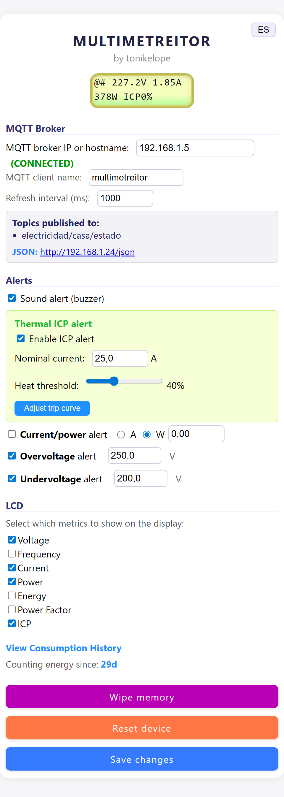
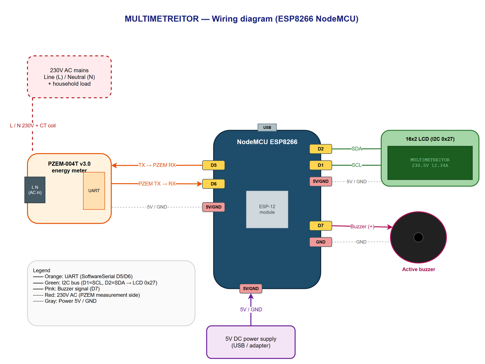
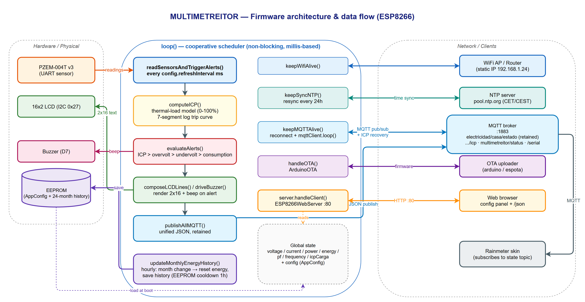

# ⚡ MULTIMETREITOR

Home electrical consumption monitor based on the **ESP8266** and the **PZEM-004T v3.0** energy meter. It measures the voltage, current, power, energy, frequency and power factor of your mains installation, shows them on an LCD display and publishes them over **MQTT**. It also includes a **thermal model of the ICP** (the main circuit breaker / power-control switch used in Spain) that warns you *before* the utility cuts your power for drawing too much.

It ships with a **web configuration panel** served by the device itself and a **Rainmeter skin** to display the metrics on the Windows desktop.

---

## ✨ Features

- 📊 **Real-time measurement** via the PZEM-004T v3: voltage (V), current (A), power (W), energy (kWh), frequency (Hz) and power factor.
- 🔥 **ICP thermal model**: simulates the trip curve of a thermal-magnetic breaker using logarithmic interpolation and a configurable cooldown. Warns when the accumulated "thermal load" approaches the trip point (0–100 %).
- 🚨 **Configurable alerts**: ICP, overvoltage, undervoltage and consumption (by amperes or watts), with an optional **buzzer**.
- 🖥️ **16×2 I2C LCD** with metrics selectable through a bitmask plus WiFi/MQTT status indicators.
- 🌐 **Responsive web panel** (HTML embedded in `PROGMEM`) to configure everything without recompiling.
- 🌍 **Bilingual UI (Spanish / English)** in both the web panel and the Rainmeter skin, with a one-click toggle. Default is Spanish.
- 📡 **MQTT publishing** with a unified JSON payload and *retained* messages.
- 🗓️ **Monthly consumption history** (24 months) with automatic energy reset on month change, persisted to EEPROM.
- 🕐 **NTP synchronization** with the Spanish mainland timezone (CET/CEST with automatic DST changes).
- 🔄 **OTA updates** (Over-The-Air), password protected.
- 💾 **EEPROM persistence** with integrity validation (magic + version) and wear protection (1-hour write cooldown for automatic tasks).

<div align="center">
  
  <br>
  <em>Web configuration panel — mobile view (English)</em>
</div>

---

## 🔌 Hardware

| Component             | Detail                                    |
|-----------------------|-------------------------------------------|
| MCU                   | ESP8266 (NodeMCU / Wemos D1 mini)         |
| Meter                 | PZEM-004T v3.0 (UART)                      |
| Display               | 16×2 LCD with I2C backpack (address `0x27`) |
| Alarm                 | Active buzzer                             |

### Wiring (pins)

| Signal            | ESP8266 pin | Notes                          |
|-------------------|-------------|--------------------------------|
| PZEM RX           | `D6`        | `SoftwareSerial` RX            |
| PZEM TX           | `D5`        | `SoftwareSerial` TX            |
| LCD SDA / SCL     | `D2` / `D1` | Default I2C (`Wire`)           |
| Buzzer            | `D7`        | Digital output                 |



---

## 🧩 Firmware architecture



**Monolithic** firmware (`multimetreitor.ino`) organized into functional blocks:

- **Config / EEPROM** — `struct AppConfig` serialized to EEPROM with validation and default values.
- **WiFi / OTA / NTP** — connection with retries, OTA and time sync via a POSIX TZ string.
- **MQTT** — publishes state, log and status; recovers the ICP state at boot (reads the *retained* message from its own topic).
- **ICP model** (`computeICP`) — integrates the thermal load based on the I/Iₙ ratio using a 7-segment logarithmically interpolated curve.
- **Alerts** (`evaluateAlerts`) — priority: ICP → overvoltage → undervoltage → consumption.
- **LCD** (`composeLCDLines`) — composes two 16-character lines with the active metrics.
- **Web server** — configuration panel + JSON endpoints.
- **History** — monthly consumption management and month-change handling.

### MQTT topics

| Topic                          | Direction  | Content                                    |
|--------------------------------|------------|--------------------------------------------|
| `electricidad/casa/estado`     | publish    | JSON with all metrics (*retained*)         |
| `electricidad/casa/icp`        | subscribe  | ICP state recovery at boot                 |
| `multimetreitor/status`        | publish    | `online` (*retained*)                      |
| `multimetreitor/serial`        | publish    | Serial-port log                            |

**Example state payload:**

```json
{
  "voltaje": "230.5V",
  "corriente": "12.34A",
  "potencia": "2840W",
  "energia": "123.45kWh",
  "factor_potencia": "0.95",
  "frecuencia": "50.0Hz",
  "icp": "62%",
  "timestamp": 1700000000
}
```

> ℹ️ The JSON keys are in Spanish (`voltaje`, `corriente`, …) because they are the published data contract consumed by the Rainmeter skin.

---

## 🖥️ Rainmeter skin

`Rainmeter/Multimetreitor/` contains a skin that displays the MULTIMETREITOR metrics directly on the Windows desktop, consuming the data over MQTT.

**Skin features:**

- Reads from the MQTT broker through Rainmeter's **[MqttClient](https://github.com/anschnapp/MqttPlugin)** plugin and parses the JSON published by the firmware.
- Shows: **Voltage, Frequency, Current, ICP (progress bar), Power, Power Factor and monthly Consumption**.
- **Visual warnings**: red background on *Current* when it exceeds 30 A, and an ICP bar proportional to the thermal load (width = `ICP × 2.5`).
- Automatically fixes locale decimals (comma → dot) and the connection status for internal calculations (`Substitute`).
- Includes optional support for a **water heater** (`calentador_estado`, `calentador_corriente`) that lights up red when it is off.
- **Bilingual labels (ES/EN)** — click the language button (top-right of the skin) to switch; the choice is saved in the `Language` variable (see [Languages](#-languages-es--en)).

### Installing the skin

1. Install [Rainmeter](https://www.rainmeter.net/).
2. Install the **MqttClient** plugin (copy the `.dll` into `Rainmeter/Plugins`).
3. Copy the `Rainmeter/Multimetreitor` folder into `Documents/Rainmeter/Skins/`.
4. Edit the `[Variables]` section of the `.ini` and set:
   - `MQTT_BROKER` → your MQTT broker IP.
   - `MQTT_TOPIC` → the firmware's state topic (`electricidad/casa/estado`).
5. Load the skin from Rainmeter (*Refresh all* / *Manage*).

> ℹ️ By default the `.ini` ships with `MQTT_TOPIC=rainmeter/multimetreitor`; change it to the topic the firmware actually publishes (`electricidad/casa/estado`) or adapt the topic on the device.

---

## 🌍 Languages (ES / EN)

Both UIs are bilingual and **default to Spanish**. Only the labels/UI text are translated — the metric values and units (V, A, W…) are language-neutral.

### Web panel
- Click the **`EN` / `ES` button** at the top-right of the page to switch language instantly (client-side, no reload).
- The choice is remembered per browser via `localStorage` (`mmt_lang`).
- To add or tweak strings, edit the `I18N = { es: {…}, en: {…} }` dictionary in the embedded `<script>` of `multimetreitor.ino`. Translatable elements are marked with `data-i18n="key"`.

### Rainmeter skin
- Click the **language button** at the top-right of the skin to toggle ES ⇄ EN. The choice is persisted to the `Language` variable in the `.ini` (`!WriteKeyValue` + `!Refresh`).
- This uses Rainmeter's standard localization pattern: a `Language` variable in `[Variables]` plus `@Include=#@#Lang_#Language#.inc`.
- Translations live in `Rainmeter/Multimetreitor/@Resources/Lang_ES.inc` and `Lang_EN.inc`. To change the default, set `Language=ES` (or `EN`) in `[Variables]`.

---

## 🛠️ Build and flash

**Requirements (Arduino IDE / arduino-cli):**

- **ESP8266** Arduino core.
- Libraries: `PubSubClient`, `LiquidCrystal_I2C`, `PZEM004Tv30`, `ArduinoJson`, `ESP8266WebServer`, `ArduinoOTA`, `EspSoftwareSerial`.

**Steps:**

1. **Create your `secrets.h`** (see below) with your WiFi credentials.
2. Open `multimetreitor.ino` in the Arduino IDE.
3. Select the matching ESP8266 board.
4. Adjust the static IP / network configuration in `multimetreitor.ino` if needed.
5. Upload over USB the first time; afterwards you can update over **OTA** (hostname `multimetreitor-ota`).

### 🔐 Credentials (`secrets.h`)

WiFi credentials are kept **out of the source tree** in a `secrets.h` file that is git-ignored, so they are never committed. The repo ships a template, `secrets.h.example`.

To configure after cloning:

```bash
cp secrets.h.example secrets.h
```

Then edit `secrets.h` with your own values:

```cpp
#define WIFI_SSID      "YOUR_WIFI_SSID"
#define WIFI_PASSWORD  "YOUR_WIFI_PASSWORD"
```

`multimetreitor.ino` includes it via `#include "secrets.h"` and uses `WIFI_SSID` / `WIFI_PASSWORD`. The WiFi password is also reused as the OTA password.

> ℹ️ The static IP (`192.168.1.24`), gateway and hostnames are configured directly in `multimetreitor.ino` — adjust them to your network.

---

## 🏠 Network note

MULTIMETREITOR is designed as a **local home-network appliance**: the web panel keeps things fast and simple and is meant to live inside your own trusted Wi‑Fi. As such, **run it on a secure/trusted network and don't expose it directly to the Internet** (no port-forwarding) — that's the intended setup. For multi-user or untrusted environments you can add HTTP Basic Auth to the control endpoints.

---

## 📝 License

Licensed under the **GNU General Public License v3.0** — see [LICENSE](LICENSE).

Copyright © tonikelope
